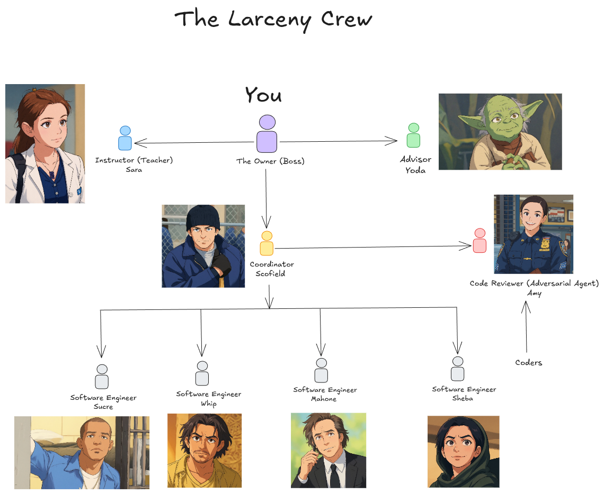

# Larceny

Larceny is a Claude Code plugin that gives you a small software team made of AI agents. You talk to one coordinator. He breaks your request into small tickets, hands them to coding agents who work in parallel, and makes sure an adversarial reviewer checks every pull request before it merges. Every change has a ticket, a branch, a pull request and a review thread on GitHub, so you can trace it back later.

The default crew is named after characters from Prison Break, with a reviewer from Brooklyn Nine-Nine and an advisor from Star Wars. You can rename any of them.



## Before you start

**Every persona is an AI agent, and agents make mistakes.** They can state something wrong with confidence, miss a real problem in review, or act on bad information. Review their work, check claims against the code or GitHub rather than an agent's report, and check before anything you can't undo: a merge, a release, a delete.

Larceny has been tested with Claude Code on one Linux machine. Some routes below are marked untested. Codex can read the skills but is untested, see [Codex](#codex). A team runs several model sessions at once, so it uses your plan's limits faster than one agent. See [docs/cost-and-safety.md](docs/cost-and-safety.md).

## What you need

- Claude Code.
- A git repository with at least one commit and a GitHub remote. Each coder works in its own worktree, so the repo needs a main branch to branch from.
- The GitHub CLI, `gh`, signed in to an account with access to that repo.
- A project board. GitHub Projects is tested. Linear through its MCP server is untested.
- Optional: a GitHub account per persona, so each one shows up under its own name. See [Persona accounts](#persona-accounts).
- Optional: Discord, to talk to the coordinator from your phone.

## Quick start

### 1. Install

Inside Claude Code:

```
/plugin marketplace add nestedmind/larceny
/plugin install larceny@larceny
```

Or ask Claude (untested):

> Install the Larceny plugin from the nestedmind/larceny marketplace using the claude plugin CLI, then tell me if I need to restart.

### 2. Set up your project

Inside Claude Code, in your project:

```
/larceny:onboard
```

Or ask Claude (untested):

> Onboard this project with Larceny.

Onboarding checks your `gh` login, repo and access, asks who you are and how you want reports, agrees the test, lint and build commands with you, and lets you pick names and models for the crew. It saves your answers in `.larceny/config.md` and adds `.larceny/` to `.gitignore`. A board, a branch ruleset and persona accounts are offered last, and you can skip each one. Running it again shows your answers and asks before changing any.

### 3. Wake up the coordinator

```
/larceny:wake-up
```

Or ask Claude (untested):

> Wake up Larceny's coordinator for this project.

The session now acts as Scofield, or as your renamed coordinator. If the project hasn't been onboarded, he runs onboarding first. He asks before starting any agent. `/larceny:wake-up` itself has not been run in a live session yet.

### Coming back later

From a terminal, start a session as the coordinator:

```
claude --agent larceny:coordinator
```

To make the coordinator the default for a project, add `{"agent": "larceny:coordinator"}` to `.claude/settings.json`. The plugin never sets this for you.

## The team

| Name | Role | Default model |
|---|---|---|
| Scofield | Coordinator: plans, dispatches coders, reports to you | Opus |
| Sucre, Mahone, Whip, Sheba | Coders: one ticket each, in their own worktree | Sonnet |
| Amy | Adversarial reviewer: reviews pull requests against their tickets | Opus |
| Yoda | Advisor: questions the coordinator's decisions when you ask | Fable |
| Sara | Teacher: explains things in steps | Opus |

The models are a recommendation. Onboarding lets you keep them, run everything on your harness default, or change any persona.

## How it works

1. You tell the coordinator what you want.
2. He turns it into tickets on the board and works out which ones can run at the same time.
3. Each coder takes one ticket, builds it on its own branch with tests, and opens a pull request.
4. Amy reviews the pull request against its ticket. The coder fixes what she raises.
5. If a review reaches a third round, the coordinator steps in. At the fifth round, it is escalated to you.
6. Once Amy passes it, the work merges and the coordinator reports back.

## Commands

| Command | What it does | Or ask Claude (untested) |
|---|---|---|
| `/larceny:onboard` | Sets up the project | "Onboard this project with Larceny." |
| `/larceny:wake-up` | Makes this session the coordinator | "Wake up Larceny's coordinator." |
| `/larceny:spawn-reviewer` | Starts Amy | "Start Larceny's reviewer and ask her to review PR 12." |
| `/larceny:spawn-advisor` | Starts Yoda | "Ask Larceny's advisor what he thinks of this plan." |
| `/larceny:spawn-teacher` | Starts Sara | "Ask Larceny's teacher to explain git rebase." |

Add a project name after a spawn command, such as `/larceny:spawn-advisor my-app`, to give the persona one project to look at. Once a persona is running, ask the main session to relay: "Ask Amy: review PR 12." You can also start a session straight into a role with `claude --agent larceny:reviewer`, `larceny:advisor` or `larceny:teacher`. Details are in [docs/agent-lifecycle.md](docs/agent-lifecycle.md).

## Customize

- **Rename the crew.** Onboarding can write your own names for any persona without changing the plugin's files. See [docs/renaming.md](docs/renaming.md).
- **Use the same crew everywhere.** Save your crew once and every new project on this machine can use it. A project's own config always wins. See [docs/crew-resolution.md](docs/crew-resolution.md).
- **Change models.** Set per persona in the `models:` line of `.larceny/config.md`. See [docs/agent-lifecycle.md](docs/agent-lifecycle.md#model-overrides).

### Persona accounts

One ordinary GitHub login is enough to run the team. Giving each persona its own account is optional. Without one, every commit and review shows up under your name, and because GitHub doesn't let an account approve its own pull request, Amy gives her verdict as a comment instead of an approval. A person has to create each account, since GitHub requires email verification and a captcha. See [docs/identity-wiring.md](docs/identity-wiring.md).

## Uninstall

Inside Claude Code:

```
/plugin uninstall larceny@larceny
```

Or ask Claude (untested):

> Uninstall Larceny. First list every file and setting it left in this project, using .larceny/config.md to find them, and wait for my OK before deleting anything.

Uninstalling removes the plugin but not the files its work left in your projects: renamed persona files, `.larceny/`, worktrees, tokens and settings. The prompt above finds them for you. To do it by hand, follow [docs/uninstall.md](docs/uninstall.md).

## Codex

Codex can read the skills in `skills/` through `.codex-plugin/plugin.json`. The agents and commands are Claude Code features, so Codex users run the personas by hand. None of this has been tested. If you try it, tell us what worked on the [issues page](https://github.com/nestedmind/larceny/issues).

## More

- [docs/limitations.md](docs/limitations.md): what is untested or doesn't work yet, including why a GitHub comment doesn't wake a local session.
- [docs/smoke-test.md](docs/smoke-test.md): what has been tested, and the checklist for a clean-machine install.
- [docs/cost-and-safety.md](docs/cost-and-safety.md): token cost, GitHub tokens and what agents can run.
- [CONTRIBUTING.md](CONTRIBUTING.md): how to pick a ticket, open a pull request and add a skill or persona.

## License

MIT. See `LICENSE`. Adapted skills are credited in `THIRD_PARTY.md`.
